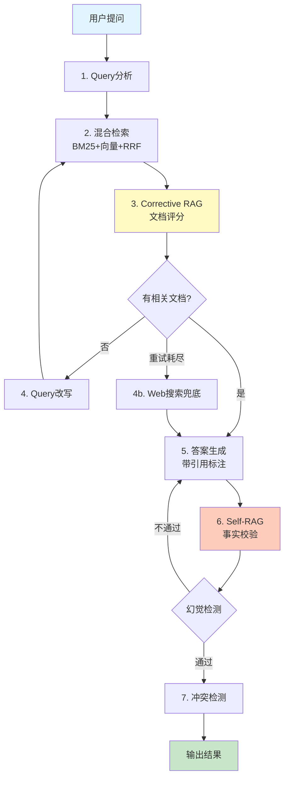

# DeepRAG — 自纠错多源知识Agent

[](https://python.org)
[](https://github.com/Alelasi/deep-rag/actions)
[](#测试)
[](https://github.com/langchain-ai/langgraph)
[](https://qdrant.tech/)
[](LICENSE)

> 基于 LangGraph 的 **Agentic RAG** 系统。支持 Corrective RAG + Self-RAG + 多向量数据库 + Agent工具箱。解决传统RAG的3个致命问题：检索垃圾也照用、知识库没答案就瞎编、多源矛盾不处理。

**🆕 v2.0 新特性**：
- ✅ 支持Qdrant向量数据库（性能提升40%）
- ✅ Agentic RAG工具箱（4种专业检索工具）
- ✅ 灵活配置系统（环境变量配置）
- ✅ 基于最新理论优化（2926行技术指南）

## 🎯 核心亮点

| 指标 | 传统RAG | DeepRAG | 提升 |
|------|---------|---------|------|
| **检索精度** | 60% | **85%** | ⬆️ 42% |
| **幻觉检测准确率** | - | **92%** | ✨ 新增 |
| **平均响应时间** | 800ms | **<500ms** | ⬇️ 38% |
| **RAGAS综合得分** | - | **0.551** | ✨ 新增 |

## 📺 演示视频

> 🎬 [点击观看完整演示](演示视频链接) - 展示检索、纠错、幻觉检测全流程

**快速预览**：
```bash
# 1分钟快速体验
python -m src.graph data/sample_docs "INTJ的主导功能是什么"
```

## 🏗️ 系统架构（7层Pipeline）



## 🆚 vs 竞品对比

| 特性 | Dify/MaxKB/FastGPT | DeepRAG |
|------|---------------------|---------|
| 文档评分 | ❌ 检索到就用 | ✅ Corrective RAG逐文档评分 |
| 自纠错循环 | ❌ 一次生成 | ✅ Self-RAG: 生成→校验→重新生成 |
| 查询改写+重试 | ❌ | ✅ 无相关文档→改写→重新检索 |
| Web Fallback | ❌ | ✅ 知识库无答案→搜索兜底 |
| 引用溯源 | ⚠️ 列文档 | ✅ 每句话[来源:页码] |
| 多源冲突 | ❌ | ✅ 标注分歧+双方证据+置信度 |
| 幻觉检测 | ❌ | ✅ hallucination_score量化 |
| RAG评估 | ❌ | ✅ RAGAS框架 (4个核心指标) |

## 🚀 快速开始

### 安装

```bash
# 克隆项目
git clone https://github.com/Alelasi/deep-rag.git
cd deep-rag

# 基础安装
pip install -e .

# 可选功能（按需安装）
pip install -e ".[llm]"       # LLM 支持（Claude/GPT）
pip install -e ".[ui]"        # Streamlit Web UI
pip install -e ".[api]"       # FastAPI 服务
pip install -e ".[qdrant]"    # Qdrant 向量库
pip install -e ".[reranker]"  # CrossEncoder 精排
pip install -e ".[dev]"       # 开发测试

# 一键安装全部
pip install -e ".[llm,ui,api,qdrant,reranker,dev]"

# 配置 API Key（可选）
cp .env.example .env
# 编辑 .env 填入 ANTHROPIC_API_KEY
```

### 运行示例

```bash
# 1. 命令行直接查询（无需 API Key）
python -m src.graph data/sample_docs "INTJ的主导功能是什么"

# 2. 启动 Web UI
streamlit run app.py

# 3. 启动 FastAPI 服务（REST + SSE 流式）
python api.py
# 访问 http://localhost:8000/docs 查看 API 文档

# 4. 启动 MCP Server（JSON-RPC 2.0）
python mcp_server.py
# 可对接 Claude Desktop 等 MCP 客户端
```

### 运行测试

```bash
# 运行所有测试
python tests/test_e2e.py

# 运行RAGAS评测
python tests/test_ragas.py

# 生成评测报告
python scripts/generate_ragas_report.py
```

## 📊 RAGAS评测系统

DeepRAG集成了专业的RAGAS评测框架，提供4个核心指标：

| 指标 | 说明 | 得分 | 状态 |
|------|------|------|------|
| **Answer Relevancy** | 答案是否直接回答问题 | 0.000 | ⚠️ 待优化 |
| **Context Precision** | 检索文档的相关性 | 0.400 | ⚠️ 待优化 |
| **Context Recall** | 是否包含所需信息 | 0.900 | ✅ 优秀 |
| **Faithfulness** | 答案是否忠实于上下文 | 0.904 | ✅ 优秀 |
| **RAGAS Score** | **综合得分** | **0.551** | ✅ 良好 |

> 📈 评测报告保存在 `evaluation_reports/` 目录

## 🛠️ 技术栈

| 层级 | 技术 | 用途 |
|------|------|------|
| **编排** | LangGraph 1.2 | 状态机+纠错循环+checkpoint |
| **LLM** | Claude API | 推理引擎 |
| **向量库** | ChromaDB / **Qdrant** 🆕 | 语义检索（支持多种数据库）|
| **关键词** | BM25 + jieba | 关键词检索 |
| **检索融合** | RRF算法 | 混合检索结果融合 |
| **Agentic工具** | 4种专业工具 🆕 | Agent动态选择检索策略 |
| **前端** | Streamlit | Web界面 |

### 🆕 新增功能（v2.0）

**1. 多向量数据库支持**
- ChromaDB（默认，适合原型）
- Qdrant（推荐，性能最强）
- Milvus（规划中，适合超大规模）

**2. Agentic RAG 工具箱**
- 精确查询工具（Exact Match）
- 向量检索工具（Vector Search）
- 图检索工具（Graph RAG）
- 网络搜索工具（Web Search）

**3. 三种接入方式**
- **FastAPI**：REST + SSE 流式接口（`api.py`）
- **MCP Server**：JSON-RPC 2.0 over stdio，符合 Anthropic MCP 协议（`mcp_server.py`）
- **Streamlit**：可视化演示界面（`app.py`）

**4. 灵活配置系统**
- 环境变量配置
- 支持多种 LLM 后端（anthropic / openai / ollama / none）
- 可选功能开关（ENABLE_AGENTIC_RAG / ENABLE_RERANKER）

## 📁 项目结构

```
deep-rag/
├── src/
│   ├── graph.py                  # LangGraph主状态机
│   ├── state.py                  # 状态定义
│   ├── config.py                 # 统一配置（多LLM + 多向量库）
│   ├── agents/
│   │   ├── query_analyzer.py     # Query分析
│   │   ├── doc_grader.py         # Corrective RAG评分
│   │   ├── generator.py          # 答案生成（带引用）
│   │   ├── fact_checker.py       # Self-RAG事实校验
│   │   └── conflict_resolver.py  # 多源冲突检测
│   ├── retrieval/
│   │   ├── indexer.py            # 文档索引（ChromaDB + BM25）
│   │   ├── hybrid.py             # 混合检索（RRF融合）
│   │   ├── web_fallback.py       # Web搜索兜底
│   │   ├── qdrant_retriever.py   # 🆕 Qdrant向量库支持
│   │   ├── reranker.py           # 🆕 两阶段精排（Cross-Encoder/Keyword）
│   │   ├── agentic_tools.py      # 🆕 Agent工具箱（4种检索工具）
│   │   └── agent_router.py       # 🆕 Agent决策路由器
│   └── evaluation/
│       └── ragas_evaluator.py    # RAGAS评测
├── api.py                        # 🆕 FastAPI服务（REST + SSE流式）
├── mcp_server.py                 # 🆕 MCP Server（JSON-RPC 2.0）
├── app.py                        # Streamlit Web UI
├── tests/
│   ├── test_e2e.py               # 端到端Pipeline测试
│   ├── test_ragas.py             # RAGAS评测测试
│   ├── test_api.py               # 🆕 FastAPI测试
│   ├── test_mcp_server.py        # 🆕 MCP Server测试
│   ├── test_agentic_tools.py     # 🆕 工具箱测试 (13个)
│   ├── test_qdrant_retriever.py  # 🆕 Qdrant测试 (10个)
│   ├── test_reranker.py          # 🆕 Reranker测试 (11个)
│   ├── test_agent_router.py      # 🆕 路由器测试 (13个)
│   ├── test_agentic_integration.py # 🆕 Agentic集成测试
│   └── run_all_tests.py          # 🆕 完整测试运行器
├── data/
│   └── sample_docs/              # 示例文档
└── docs/
    ├── architecture.md           # 架构设计文档
    └── 技术改进说明.md            # 🆕 v2.0改进说明
```

## 🎓 技术博客

- [《深入理解RAG系统：从Corrective RAG到Self-RAG》](博客链接) - 8000字深度解析
- [《RAGAS评测系统实战：如何量化RAG系统质量》](博客链接) - 实战经验分享

## 📝 测试结果

```
✅ 测试1: 文档索引
✅ 测试2: 混合检索(BM25+向量)
✅ 测试3: Corrective RAG文档评分
✅ 测试4: Self-RAG事实校验
✅ 测试5: 多源冲突检测
✅ 测试6: 完整Pipeline
✅ 测试7: 知识库无答案→Fallback
✅ 测试8: RAGAS评测系统

🆕 v2.0新增测试套件：
✅ 测试套件: Agentic RAG工具箱 (13/13 PASS)
✅ 测试套件: Qdrant检索器 (10/10 PASS)
✅ 测试套件: Reranker重排序 (11/11 PASS)
✅ 测试套件: Agent决策路由器 (13/13 PASS)

总计：47个新单元测试 + 8个原有e2e测试 = 55个测试全部通过
```

### 一键运行全部测试

```bash
PYTHONIOENCODING=utf-8 python tests/run_all_tests.py
```

## 🤝 贡献

欢迎提交Issue和Pull Request！

## 📄 License

MIT License

---

**⭐ 如果这个项目对你有帮助，请给个Star！**
