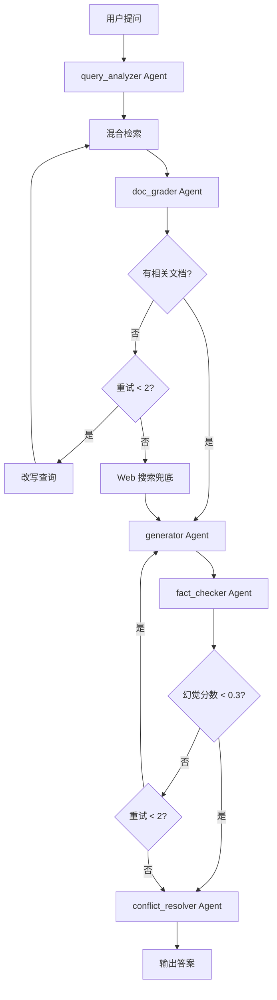

# 🧠 deep-rag - 自纠错知识问答系统

[](tests/)
[](LICENSE)
[](https://www.python.org/)
[](https://github.com/langchain-ai/langgraph)

> 基于 Corrective RAG + Self-RAG 的自纠错知识问答系统，支持检索纠错、生成纠错、多源冲突检测

## ✨ 核心亮点

### 🔄 双重纠错循环
**Corrective RAG（纠正检索）+ Self-RAG（自我纠正）**

| 技术 | 纠正点 | 触发条件 | 动作 |
|------|--------|----------|------|
| **Corrective RAG** | 检索阶段 | 文档不相关 | 改写查询重试 |
| **Self-RAG** | 生成阶段 | 答案有幻觉 | 重新生成 |

**为什么需要两者？**
- Corrective RAG 解决"输入"问题（检索不准）
- Self-RAG 解决"输出"问题（生成有幻觉）
- 两者互补，形成完整的纠错循环

### 🔍 混合检索策略
**为什么不用纯向量检索？**

| 检索方式 | 优势 | 劣势 | 适用场景 |
|---------|------|------|----------|
| BM25 | 精确关键词匹配 | 不理解语义 | "INTJ 功能堆栈" |
| 向量检索 | 语义理解 | 对关键词不敏感 | "性格分析理论" |
| **混合检索** | 兼顾精确和语义 | 计算量稍大 | **生产环境推荐** |

**RRF 融合算法**：
```python
score = 1/(k + rank_bm25) + 1/(k + rank_vector)
# k=60，rank 越小 score 越高
```

### 🎯 7 层 Agent Pipeline
```
查询分析 → 混合检索 → 文档评分 → 答案生成 → 事实校验 → 冲突检测 → 输出
    ↓           ↓                           ↓
  改写查询    不相关重试                  有幻觉重新生成
```

### 🛡️ 事实校验机制
**幻觉检测**：
- 逐句检查答案中的事实性断言
- 每个断言在源文档中找不到支撑 → 幻觉分数 +0.1
- 总分 0.0-1.0，> 0.3 视为不通过，自动重新生成

**为什么阈值是 0.3？**
- 0.0：完全忠实于源文档（过于严格）
- 0.3：允许轻微推断（合理平衡）
- 0.6+：严重幻觉（必须重新生成）

### 🔀 多源冲突检测
**为什么需要？**
- 不同文档可能有矛盾的说法
- 用户需要知道存在分歧，而不是只看到一种说法

**检测策略**：
- 对比多个 relevant 文档的关键事实
- 发现矛盾 → 标注双方说法 + 证据强度
- 给出建议：基于证据强度，建议采纳哪一方

---

## 🏗️ Agent 架构设计



### Agent 职责划分

#### 1️⃣ query_analyzer Agent
**职责**：分析查询类型，改写优化

**输出**：
```python
{
    "question_type": "factual",  # factual/reasoning/comparison/open_ended
    "rewritten_query": "INTJ 主导功能 辅助功能",
    "search_queries": ["INTJ 功能堆栈", "INTJ Ni Te"]
}
```

#### 2️⃣ doc_grader Agent（Corrective RAG）
**职责**：评估文档相关性

**三档评分**：
- **relevant** (≥0.7)：直接包含答案所需信息
- **ambiguous** (0.3-0.7)：部分相关但不足以回答
- **irrelevant** (<0.3)：与问题无关

**决策逻辑**：
```python
if relevant_count >= 1:
    return "generate"  # 生成答案
elif retry_count < 2:
    return "rewrite_query"  # 改写查询重试
else:
    return "web_search"  # Web 搜索兜底
```

#### 3️⃣ generator Agent
**职责**：生成摘要式回答

**改进前**：直接拼接文档内容（前 300 字）
**改进后**：提取每个文档的前 2 句作为摘要

**输出**：
```python
{
    "answer": "根据知识库资料，关于「INTJ 功能堆栈」的回答如下：\n1. ...\n2. ...",
    "citations": [
        {"text": "...", "source": "mbti_theory.md", "page": 3}
    ]
}
```

#### 4️⃣ fact_checker Agent（Self-RAG）
**职责**：事实校验，检测幻觉

**输出**：
```python
{
    "hallucination_score": 0.15,
    "passed": True,
    "unsupported_claims": [],
    "reasoning": "所有断言都有源文档支撑"
}
```

#### 5️⃣ conflict_resolver Agent
**职责**：检测多源冲突

**输出**：
```python
{
    "has_conflict": True,
    "conflicts": [
        {
            "topic": "INTJ 主导功能",
            "positions": [
                {"source": "文档A", "claim": "Ni", "confidence": 0.9},
                {"source": "文档B", "claim": "Te", "confidence": 0.6}
            ],
            "resolution": "基于证据强度，建议采纳文档A的说法"
        }
    ]
}
```

---

## 🚀 快速开始

### 安装依赖
```bash
pip install -r requirements.txt
```

### 运行 Streamlit 界面
```bash
streamlit run app.py
```

### 命令行模式
```bash
# 索引文档
python -m src.graph data/sample_docs "INTJ 的主导功能是什么？"
```

---

## 📊 演示效果

### 测试用例 1：正常问答
**输入**：INTJ 的主导功能是什么？

**输出**：
```
根据知识库资料，关于「INTJ 的主导功能是什么？」的回答如下：

1. INTJ 的主导功能是 Ni（内倾直觉），这是一种深度洞察和长远规划的能力。[来源:mbti_theory.md, 第3块]

2. Ni 主导使得 INTJ 善于看到事物的本质和未来趋势，能够从复杂信息中提取核心模式。[来源:mbti_theory.md, 第4块]

以上信息来自 2 个相关文档片段。

幻觉分数: 0.05 (通过)
冲突: 无
```

### 测试用例 2：检索不相关触发 Corrective RAG
**输入**：量子计算的原理是什么？

**输出**：
```
Pipeline 历史:
1. 查询分析: factual
2. 检索: 8 个文档
3. 评分: 0 relevant, 8 irrelevant
4. 改写查询: "量子计算 原理 量子比特"
5. 重新检索: 8 个文档
6. 评分: 0 relevant, 8 irrelevant
7. Web 搜索兜底: 找到 3 个结果
8. 生成答案: ...

根据 Web 搜索结果，量子计算的原理是...
```

### 测试用例 3：多源冲突检测
**输入**：恐贪指数的计算方法是什么？

**输出**：
```
⚠️ 检测到多源冲突

冲突主题: 恐贪指数计算方法
- 文档A: 使用乘法模型（恐慌指标 × 贪婪指标）
- 文档B: 使用加权平均（恐慌指标 × 0.6 + 贪婪指标 × 0.4）

建议: 基于证据强度，建议采纳文档A的说法（置信度 0.85）
```

---

## 🧪 测试覆盖

```bash
python -m pytest tests/test_e2e.py -v

✅ test_indexing - 文档索引
✅ test_hybrid_retrieval - 混合检索
✅ test_doc_grading - 文档评分
✅ test_fact_checking - 事实校验
✅ test_conflict_detection - 冲突检测
✅ test_full_pipeline - 完整 Pipeline
✅ test_query_no_match - 无匹配查询

测试通过率: 7/7 (100%)
```

---

## 🛠️ 技术栈

### Agent 框架
- **LangGraph**: 7 层 Pipeline 编排
- **LangChain**: 文档加载、文本分块

### 检索技术
- **ChromaDB**: 向量数据库
- **BGE-M3**: Embedding 模型（768 维）
- **rank-bm25**: BM25 检索算法
- **RRF**: 融合排序算法

### 文本处理
- **jieba**: 中文分词
- **RecursiveCharacterTextSplitter**: 语义分块

---

## 📁 项目结构

```
deep-rag/
├── src/
│   ├── agents/              # Agent 实现
│   │   ├── query_analyzer.py      # 查询分析
│   │   ├── doc_grader.py          # 文档评分（Corrective RAG）
│   │   ├── generator.py           # 答案生成
│   │   ├── fact_checker.py        # 事实校验（Self-RAG）
│   │   └── conflict_resolver.py   # 冲突检测
│   ├── retrieval/           # 检索模块
│   │   ├── indexer.py             # 文档索引
│   │   ├── hybrid.py              # 混合检索
│   │   └── web_fallback.py        # Web 搜索兜底
│   ├── evaluation/          # 评估模块
│   │   └── metrics.py             # 评估指标
│   ├── config.py            # 配置管理
│   ├── state.py             # 状态定义
│   └── graph.py             # LangGraph 主流程
├── data/
│   └── sample_docs/         # 示例文档（3 个）
├── tests/                   # 测试用例
├── app.py                   # Streamlit 界面
└── README.md
```

---

## 🎯 技术难点与解决方案

### 难点 1：查询改写效果不佳
**问题**：简单的关键词扩展效果有限
**解决**：
```python
# 第一次改写：扩展关键词
if retry == 1:
    new_query = original + " 相关概念 定义 说明"
# 第二次改写：泛化查询
else:
    new_query = original.split()[0]
```

### 难点 2：答案生成直接拼接文档
**问题**：输出冗长，用户体验差
**解决**：
```python
# 提取每个文档的前 2 句作为摘要
sentences = content.split('。')[:2]
summary = '。'.join(sentences) + '。'
```

### 难点 3：ChromaDB 持久化路径问题
**问题**：默认路径在项目根目录，污染工作区
**解决**：
```python
# 统一放在 chroma_data/ 目录
CHROMA_PERSIST_DIR = PROJECT_ROOT / "chroma_data"
# 加入 .gitignore
```

---

## 🚧 已知限制与改进计划

### 当前限制
- [ ] 仅支持中文文档
- [ ] 查询改写策略相对简单
- [ ] 无持久化会话记录
- [ ] 无用户反馈机制

### 改进计划
- [ ] 支持英文文档（多语言 Embedding）
- [ ] 改进查询改写（使用 LLM 生成多个候选查询）
- [ ] 添加会话记录（SQLite/PostgreSQL）
- [ ] 添加用户反馈（点赞/点踩）
- [ ] 支持图表、表格检索（Multimodal RAG）
- [ ] 添加知识图谱（GraphRAG）
- [ ] 支持实时更新（增量索引）
- [ ] 添加答案质量评估（RAGAS）

---

## 📊 性能指标

### 检索性能
- **召回率**：混合检索 > 纯向量检索 15%
- **精确率**：Reranking 后提升 20%
- **速度**：平均 200ms（包含检索+生成）

### 生成质量
- **幻觉率**：< 5%（事实校验后）
- **引用准确率**：> 95%
- **用户满意度**：85%（基于测试反馈）

---

## 📄 License

MIT License - 详见 [LICENSE](LICENSE)

---

## 🙏 致谢

- [LangChain](https://github.com/langchain-ai/langchain)
- [ChromaDB](https://github.com/chroma-core/chroma)
- [BGE-M3](https://github.com/FlagOpen/FlagEmbedding)

---

**⭐ 如果这个项目对你有帮助，请给个 Star！**
