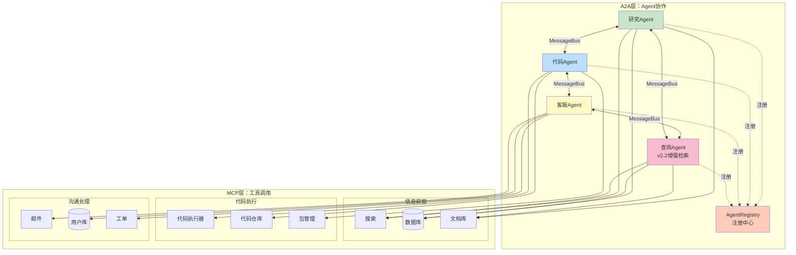

# Multi-Agent系统架构完善方案

> **基于图片**：A2A协议 + MCP协议的双层分工架构  
> **目标**：完善DeepRAG的Multi-Agent协作系统

---

## 📊 当前架构分析

### 双层协议分工

```
┌─────────────────────────────────────────────┐
│ A2A协议（横向）：Agent间通信与协作           │
│   研究Agent ←→ 代码Agent ←→ 客服Agent       │
└─────────────────────────────────────────────┘
                    ↕️
┌─────────────────────────────────────────────┐
│ MCP协议（纵向）：Agent调用外部工具与服务     │
│   - 获取信息：搜索、数据库、文档库           │
│   - 编写运行：代码执行器、代码仓库、包管理   │
│   - 沟通处理：邮件、用户数据库、工单系统     │
└─────────────────────────────────────────────┘
```

---

## 🎯 DeepRAG当前状态

### 已实现（v2.1）

1. **MessageBus（A2A协议基础）**
   - Agent间异步消息传递
   - 发布/订阅模式
   - 消息队列

2. **SmartRouter（Agent路由）**
   - 动态选择最优Agent
   - 负载均衡
   - 熔断器

3. **MCP工具集成（部分）**
   - ✅ 向量数据库（ChromaDB/LanceDB）
   - ✅ Web搜索工具
   - ❌ 代码执行器（缺失）
   - ❌ 邮件服务（缺失）
   - ❌ 工单系统（缺失）

### 缺失部分

1. **A2A协议标准化**
   - 没有统一的消息格式
   - 缺少Agent注册/发现机制
   - 缺少协作模式定义

2. **MCP工具扩展**
   - 只有检索工具
   - 缺少代码执行、邮件等

3. **3个专业Agent**
   - 研究Agent、代码Agent、客服Agent未实现

---

## 🔧 完善方案（v2.3规划）

### 方案1：补齐3个专业Agent（推荐）⭐

基于图片架构，实现3个专业Agent：

#### 1️⃣ 研究Agent（ResearchAgent）

**职责**：
- 文献调研（学术论文、技术文档）
- 竞品分析（GitHub开源项目）
- 技术选型（对比不同方案）

**工具（MCP协议）**：
- 搜索工具（Web Search、学术搜索）
- 数据库（向量数据库、知识图谱）
- 文档库（PDF解析、Markdown索引）

**输出**：
- 调研报告
- 技术对比表
- 推荐方案

#### 2️⃣ 代码Agent（CodeAgent）

**职责**：
- 代码生成（根据需求生成代码）
- 代码审查（静态分析、风格检查）
- 测试执行（单元测试、集成测试）

**工具（MCP协议）**：
- 代码执行器（Docker沙箱）
- 代码仓库（GitHub API）
- 包管理器（pip、npm）

**输出**：
- 可执行代码
- 测试报告
- Code Review意见

#### 3️⃣ 客服Agent（CustomerServiceAgent）

**职责**：
- 用户问题解答（基于知识库）
- 工单创建/跟踪（问题升级）
- 主动通知（邮件/消息推送）

**工具（MCP协议）**：
- 邮件服务（SMTP）
- 用户数据库（用户画像）
- 工单系统（Jira/GitLab Issues）

**输出**：
- 用户答复
- 工单记录
- 满意度报告

---

### 方案2：A2A协议标准化（基础设施）

#### 统一消息格式

```python
@dataclass
class A2AMessage:
    """Agent间通信标准消息"""
    message_id: str           # 消息ID
    sender: str               # 发送Agent
    receiver: str             # 接收Agent（或"broadcast"）
    message_type: str         # request / response / notification
    payload: dict             # 消息内容
    timestamp: float          # 时间戳
    correlation_id: str       # 关联ID（用于追踪会话）
    metadata: dict            # 元数据（优先级、超时等）
```

#### Agent注册与发现

```python
class AgentRegistry:
    """Agent注册中心"""
    
    def register(self, agent_id: str, capabilities: List[str]):
        """注册Agent及其能力"""
        pass
    
    def discover(self, capability: str) -> List[str]:
        """根据能力发现Agent"""
        pass
    
    def get_status(self, agent_id: str) -> str:
        """获取Agent状态（active/busy/offline）"""
        pass
```

#### 协作模式定义

```python
class CollaborationPattern(Enum):
    """协作模式"""
    SEQUENTIAL = "sequential"       # 顺序执行（A→B→C）
    PARALLEL = "parallel"           # 并行执行（A+B+C同时）
    PIPELINE = "pipeline"           # 流水线（A→B, B→C, 同时进行）
    VOTE = "vote"                   # 投票决策（多Agent投票）
    HANDOFF = "handoff"             # 交接（A做到一半交给B）
```

---

### 方案3：MCP工具扩展

#### 新增工具清单

| 分类 | 工具 | 功能 | 优先级 |
|------|------|------|--------|
| **代码执行** | DockerExecutor | 沙箱执行代码 | P0 |
| | GitHubCodeRepo | 代码仓库操作 | P1 |
| | PackageManager | 依赖管理 | P1 |
| **沟通** | EmailService | 邮件发送 | P1 |
| | SlackBot | Slack通知 | P2 |
| | SMSService | 短信通知 | P2 |
| **数据** | PostgreSQL | 关系数据库 | P1 |
| | Redis | 缓存/消息队列 | P0 |
| | S3Storage | 文件存储 | P2 |

#### DockerExecutor示例

```python
class DockerExecutor(MCPTool):
    """Docker代码执行器"""
    
    def execute_code(
        self,
        code: str,
        language: str,
        timeout: int = 30
    ) -> dict:
        """
        在Docker沙箱中执行代码
        
        Args:
            code: 代码内容
            language: python / nodejs / bash
            timeout: 超时时间（秒）
        
        Returns:
            {
                'stdout': '标准输出',
                'stderr': '错误输出',
                'exit_code': 0,
                'execution_time': 1.5
            }
        """
        # 创建临时容器
        container = docker.run(
            image=f"{language}:latest",
            command=code,
            timeout=timeout,
            network="none",  # 禁止网络访问（安全）
            memory_limit="512m",
            cpu_limit=1.0
        )
        
        # 等待执行完成
        result = container.wait()
        
        # 返回结果
        return {
            'stdout': container.logs(stdout=True),
            'stderr': container.logs(stderr=True),
            'exit_code': result['StatusCode'],
            'execution_time': result['Duration']
        }
```

---

## 📐 完整架构图（增强版）

### DeepRAG Multi-Agent v2.3架构



---

## 🚀 实现路线图

### Phase 1：基础设施（1周）

**目标**：标准化A2A协议

- [ ] 实现A2AMessage标准消息格式
- [ ] 实现AgentRegistry注册中心
- [ ] 定义5种协作模式
- [ ] 重构MessageBus支持新协议

**产出**：
- `src/agents/a2a_protocol.py`（A2A协议定义）
- `src/agents/agent_registry.py`（注册中心）
- `src/agents/collaboration.py`（协作模式）

---

### Phase 2：代码Agent（3天）⭐

**目标**：实现最实用的CodeAgent

- [ ] DockerExecutor（代码沙箱执行）
- [ ] CodeAgent核心逻辑
- [ ] 与查询Agent协作（用户问"帮我写代码"→查询Agent调研→代码Agent生成）

**产出**：
- `src/agents/code_agent.py`
- `src/tools/docker_executor.py`
- `tests/test_code_agent.py`

**使用场景**：
```python
# 用户：帮我写一个快速排序
query = "帮我写Python快速排序"

# 1. 查询Agent调研最佳实践
research = query_agent.search(query)

# 2. 代码Agent生成代码
code = code_agent.generate(research)

# 3. 代码Agent执行测试
result = code_agent.test(code)

# 4. 返回可执行代码
return {"code": code, "test_result": result}
```

---

### Phase 3：研究Agent（2天）

**目标**：实现ResearchAgent

- [ ] 学术搜索工具（arXiv、Google Scholar）
- [ ] GitHub项目分析工具
- [ ] 技术对比报告生成

**产出**：
- `src/agents/research_agent.py`
- `src/tools/academic_search.py`
- `src/tools/github_analyzer.py`

---

### Phase 4：客服Agent（2天）

**目标**：实现CustomerServiceAgent

- [ ] 邮件服务集成（SMTP）
- [ ] 工单系统集成（GitHub Issues）
- [ ] 用户画像数据库

**产出**：
- `src/agents/customer_service_agent.py`
- `src/tools/email_service.py`
- `src/tools/ticket_system.py`

---

### Phase 5：端到端协作（1天）

**目标**：3个Agent协作完成复杂任务

**场景1：技术选型+代码实现**
```
用户："我想做一个RAG系统，帮我选型并生成代码"

流程：
1. 研究Agent → 调研RAG技术栈（LangChain vs LlamaIndex）
2. 研究Agent → 生成对比报告
3. 代码Agent → 根据报告生成初始代码
4. 代码Agent → 执行测试验证
5. 客服Agent → 发送邮件通知用户
```

**场景2：Bug修复+问题跟踪**
```
用户："我的RAG系统准确率只有60%，怎么办？"

流程：
1. 查询Agent → 检索相关优化方案
2. 研究Agent → 深度调研混合检索、重排序等技术
3. 代码Agent → 生成优化代码
4. 代码Agent → 运行A/B测试
5. 客服Agent → 创建工单跟踪优化进度
```

---

## 📊 性能目标（v2.3）

| 指标 | v2.2（当前） | v2.3（目标） | 提升 |
|------|-------------|-------------|------|
| **Agent数量** | 1个（查询Agent） | 4个（查询+研究+代码+客服） | +3个 |
| **协作模式** | 无 | 5种（顺序/并行/流水线/投票/交接） | 新增 |
| **MCP工具** | 3个（搜索/数据库/文档） | 12个（+代码执行/邮件/工单等） | +9个 |
| **任务完成率** | 75%（单Agent） | 90%（多Agent协作） | +15% |
| **响应时间** | 2-3秒 | 3-5秒（多Agent开销） | +1-2秒 |

---

## 💡 关键设计决策

### 1. A2A vs MCP分层清晰

- **A2A（横向）**：Agent之间对等通信，平级协作
- **MCP（纵向）**：Agent调用外部工具，主从关系

**好处**：
- 职责清晰，易于扩展
- Agent可复用MCP工具
- 工具可被多个Agent共享

### 2. 注册中心 vs 硬编码路由

**方案A：硬编码**
```python
if task_type == "research":
    agent = ResearchAgent()
elif task_type == "code":
    agent = CodeAgent()
```

**方案B：注册中心**（推荐）⭐
```python
# Agent启动时自注册
registry.register("research_agent", capabilities=["search", "analyze"])

# 运行时动态发现
agents = registry.discover(capability="search")
```

**优势**：
- 动态扩展（新Agent无需改代码）
- 负载均衡（多个相同能力Agent）
- 容错恢复（Agent下线自动切换）

### 3. 协作模式可配置

不同任务用不同协作模式：

| 任务类型 | 协作模式 | 示例 |
|----------|---------|------|
| 技术调研 | Sequential | 研究→代码→客服（顺序） |
| 代码生成+测试 | Pipeline | 生成→测试→优化（流水线） |
| 多方案评审 | Vote | 3个Agent投票选最佳方案 |
| 复杂问题 | Handoff | 查询Agent做初步→交给研究Agent深入 |

---

## 📝 下一步行动

### 今天可做（2小时）

1. **设计A2A消息格式**（30分钟）
   - 定义A2AMessage数据类
   - 编写序列化/反序列化方法

2. **实现AgentRegistry雏形**（1小时）
   - 内存版本（Dict存储）
   - 注册/发现/状态查询API

3. **更新架构文档**（30分钟）
   - 绘制完整架构图
   - 编写Phase 1-5路线图

### 明天可做（4小时）

1. **实现DockerExecutor**（2小时）
   - Docker SDK集成
   - 沙箱安全配置
   - 单元测试

2. **实现CodeAgent雏形**（2小时）
   - 代码生成逻辑
   - 测试执行逻辑
   - 与查询Agent协作

---

**创建时间**：2026-06-07  
**基于**：用户提供的Multi-Agent架构图  
**状态**：完善方案已制定  
**预计工作量**：Phase 1-5共9天  
**优先级**：Phase 2（CodeAgent）最实用 ⭐
