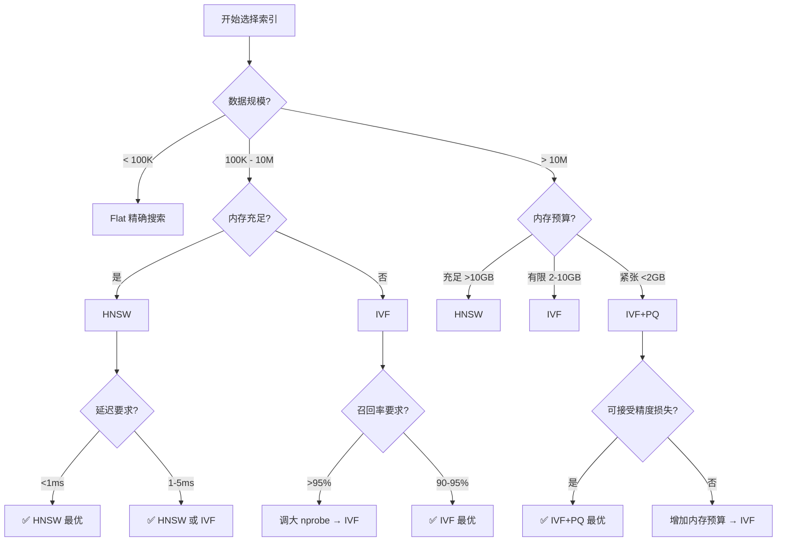

# 向量索引选择指南

> 基于数据规模、内存、延迟要求选择最优索引算法
> 参考：《AI Agent的RAG、Memory底层的语义检索原理》+ 2026年最新 Benchmark
> 更新时间：2026-05-27

---

## 📊 三大索引算法对比

### 核心原理

| 索引类型 | 核心原理 | 优势 | 劣势 |
|---------|---------|------|------|
| **HNSW** | 分层图索引，通过邻居关系快速跳转 | 速度最快（0.42ms p95）<br>召回率最高（95%+）<br>支持增量插入 | 内存占用大（2-5x）<br>构建时间长 |
| **IVF** | 聚类分桶，粗筛+精搜 | 内存友好（1/3 HNSW）<br>构建速度快<br>适合静态数据 | 召回率略低（需调参）<br>不支持增量插入 |
| **PQ** | 向量分段量化为 ID | 极致压缩（97%）<br>十亿级数据可用 | 精度损失最大<br>需要训练 |

### 性能数据（10M 向量 Benchmark）

| 指标 | HNSW | IVF | IVF+PQ |
|------|------|-----|--------|
| **查询延迟** (p95) | 0.42ms | 0.83ms | 1.2ms |
| **吞吐量** (QPS) | 11,200 | 5,600 | 8,300 |
| **内存占用** | 5.2GB | 1.8GB | 0.3GB |
| **召回率** (@k=10) | 96% | 92% | 88% |
| **构建时间** | 142s | 247s | 320s |

**数据来源**：
- [FAISS Production Benchmark](https://markaicode.com/benchmarks/faiss-production-benchmark-latency/)
- [HNSW vs IVF Comparison](https://metricgate.com/blogs/hnsw-vs-ivf-vs-pq-ann-indexes/)

---

## 🎯 索引选择决策树



---

## 📖 详细选择指南

### 场景 1：原型开发 / 小规模数据（< 100K）

**推荐**：**Flat（精确搜索）**

```python
# ChromaDB 默认（小数据自动用 Flat）
collection = client.create_collection("demo")

# FAISS Flat
import faiss
index = faiss.IndexFlatL2(dim)
```

**理由**：
- 数据量小，暴力搜索也很快（<10ms）
- 100% 召回率，无精度损失
- 无需调参，开箱即用

---

### 场景 2：生产环境 / 中等规模（100K - 10M）

#### 2.1 延迟敏感型（< 1ms p95）

**推荐**：**HNSW**

```python
# ChromaDB（默认 HNSW）
collection = client.create_collection(
    name="knowledge_base",
    metadata={"hnsw:space": "cosine"}  # 余弦距离
)

# FAISS HNSW
import faiss
index = faiss.IndexHNSWFlat(dim, M=32)
index.hnsw.efConstruction = 200
index.hnsw.efSearch = 64
```

**调参建议**：
- `M=32`：图连接度（16-64，越大越准但越慢）
- `efConstruction=200`：构建时搜索深度（100-500）
- `efSearch=64`：查询时搜索深度（16-512，越大召回率越高）

**适用场景**：
- 在线推荐系统（用户等待时间敏感）
- 实时聊天机器人
- 图像搜索（毫秒级响应）

---

#### 2.2 内存受限型（< 2GB）

**推荐**：**IVF**

```python
# FAISS IVF
import faiss
nlist = 4096  # 聚类中心数（sqrt(N) 到 4*sqrt(N)）
quantizer = faiss.IndexFlatL2(dim)
index = faiss.IndexIVFFlat(quantizer, dim, nlist)

# 训练（需要代表性样本）
index.train(train_vectors)
index.add(vectors)

# 查询时设置 nprobe（搜索多少个桶）
index.nprobe = 32  # 1-nlist，越大召回率越高
```

**调参建议**：
- `nlist`：聚类数 = `sqrt(N)` 到 `4*sqrt(N)`
  - 1M 向量 → 1024-4096
  - 10M 向量 → 3162-12648
- `nprobe`：搜索桶数 = `nlist / 10` 到 `nlist / 2`
  - 平衡召回率和速度
  - nprobe=32 通常是甜点

**适用场景**：
- 离线批处理（延迟容忍 1-5ms）
- 静态知识库（不频繁更新）
- 内存受限服务器

---

### 场景 3：超大规模（> 10M）/ 十亿级

**推荐**：**IVF + PQ**

```python
# FAISS IVF_PQ
import faiss
nlist = 16384  # 更多聚类中心
m = 8          # 子向量数（8/16/32）
nbits = 8      # 每个子向量的 bit 数（8bit = 256 聚类中心）

quantizer = faiss.IndexFlatL2(dim)
index = faiss.IndexIVFPQ(quantizer, dim, nlist, m, nbits)

# 训练（需要大量样本，建议 >100K）
index.train(train_vectors)
index.add(vectors)

# 查询
index.nprobe = 64
results = index.search(query_vectors, k=10)
```

**压缩比计算**：
- 原始：384 维 × 4 字节 = 1536 字节
- PQ 压缩：8 个子向量 × 1 字节 = 8 字节
- **压缩比**：1536 / 8 = **192:1**

**调参建议**：
- `m`：子向量数（dim 必须能被 m 整除）
  - 384 维 → m=8/12/16/24
  - 768 维 → m=8/16/24/32
- `nbits=8`：固定（256 聚类中心，1 字节）
- `nlist`：更大（16K-64K）
- `nprobe`：更大（64-128）

**适用场景**：
- 十亿级向量搜索
- 内存极度受限（<1GB）
- 可接受 5-10% 召回率损失

---

## 🔧 混合策略（生产最佳实践）

### 策略 1：IVF + HNSW（Coarse Quantizer）

```python
# FAISS 混合索引
nlist = 4096
quantizer = faiss.IndexHNSWFlat(dim, 32)  # HNSW 作为粗筛
index = faiss.IndexIVFFlat(quantizer, dim, nlist)
```

**优势**：
- HNSW 加速粗筛阶段（找最近的桶）
- IVF 减少内存占用
- 兼顾速度和内存

**适用**：10M-100M 向量，内存预算 2-5GB

---

### 策略 2：两阶段检索（Recall + Rerank）

```python
# 第一阶段：IVF+PQ 快速召回 top_k=100
index_ivfpq.nprobe = 32
candidates = index_ivfpq.search(query, k=100)

# 第二阶段：Flat 精确重排 top_k=10
index_flat = faiss.IndexFlatL2(dim)
index_flat.add(candidates_vectors)
final_results = index_flat.search(query, k=10)
```

**优势**：
- 第一阶段快速过滤（IVF+PQ）
- 第二阶段精确排序（Flat）
- 召回率接近 100%

**适用**：对召回率要求极高的场景（>98%）

---

## 📈 性能优化建议

### 1. GPU 加速

```python
# FAISS GPU（20-30x 加速）
import faiss
res = faiss.StandardGpuResources()
index_cpu = faiss.IndexIVFFlat(quantizer, dim, nlist)
index_gpu = faiss.index_cpu_to_gpu(res, 0, index_cpu)
```

**适用**：
- 查询 QPS > 1000
- 延迟要求 < 5ms
- 有 GPU 资源（T4/V100/A100）

**性能提升**：
- IVF：10-15x
- HNSW：5-8x（图遍历不太适合 GPU）

---

### 2. 批量查询

```python
# 单条查询（慢）
for query in queries:
    results = index.search(query, k=10)

# 批量查询（快 10-50x）
batch_queries = np.vstack(queries)
results = index.search(batch_queries, k=10)
```

**原因**：
- 减少 Python 调用开销
- GPU 并行处理
- 向量化计算

---

### 3. 预热索引

```python
# 首次查询会触发索引加载（慢）
# 预热：启动时执行几次查询
dummy_query = np.random.randn(1, dim).astype('float32')
index.search(dummy_query, k=10)
```

---

## 🎯 deep-rag 项目的索引选择

### 当前实现

```python
# src/retrieval/indexer.py
collection = client.create_collection(
    name="knowledge_base",
    metadata={"hnsw:space": "cosine"}  # 默认 HNSW
)
```

### 推荐配置

| 数据规模 | 推荐索引 | 配置 |
|---------|---------|------|
| < 10K | ChromaDB Flat | 默认 |
| 10K - 1M | ChromaDB HNSW | 默认（已实现）✅ |
| 1M - 10M | FAISS IVF | 新增实现 🆕 |
| > 10M | FAISS IVF+PQ | 已有 `pq_compressor.py` ✅ |

---

## 📚 参考资料

### 官方文档
- [FAISS Wiki](https://github.com/facebookresearch/faiss/wiki)
- [ChromaDB Documentation](https://docs.trychroma.com/)
- [Qdrant Indexing](https://qdrant.tech/documentation/concepts/indexing/)

### 深度文章
- [IVFPQ + HNSW for Billion-scale Search](https://towardsdatascience.com/ivfpq-hnsw-for-billion-scale-similarity-search-89ff2f89d90e)
- [Product Quantization: 97% Compression](https://www.pinecone.io/learn/series/faiss/product-quantization/)
- [Vector Indexes Deep Dive](https://medium.com/@grahamjroy/vector-indexes-ann-hnsw-ivf-pq-and-how-rag-actually-retrieves-920746ebe5d2)

### Benchmark
- [FAISS Production Benchmark: 10M Vectors](https://markaicode.com/benchmarks/faiss-production-benchmark-latency/)
- [pgvector HNSW vs IVFFlat](https://markaicode.com/benchmarks/postgresql-pgvector-benchmark/)
- [HNSW vs IVF Comparison](https://metricgate.com/blogs/hnsw-vs-ivf-vs-pq-ann-indexes/)

---

## 🎓 面试要点

### Q1：HNSW 为什么快？

**答**：分层图结构 + 贪心搜索
1. 顶层稀疏图快速定位大致区域
2. 逐层下降，图越来越密集
3. 底层精确搜索最近邻
4. 类似"六度分离理论"，几跳就能找到

**时间复杂度**：O(log N)

---

### Q2：IVF 为什么省内存？

**答**：聚类分桶 + 只搜索部分桶
1. 训练时 KMeans 聚类（如 4096 个桶）
2. 每个向量分配到最近的桶
3. 查询时只搜索最近的 32 个桶
4. 候选数从 10M 降到 10M/4096*32 ≈ 78K

**内存节省**：不需要维护图结构，只存储聚类中心 + 向量

---

### Q3：PQ 如何实现 192:1 压缩？

**答**：向量分段 + 量化为 ID
1. 384 维向量分成 8 个子向量（每个 48 维）
2. 每个子向量聚类 256 个中心（8bit）
3. 用 1 字节 ID 替代 48 维浮点数（192 字节）
4. 8 个 ID = 8 字节（原始 1536 字节）

**查询**：预计算查询向量到所有聚类中心的距离，查表求和

---

### Q4：为什么叫 ANN 而不是精确搜索？

**答**：允许小误差换取速度
- HNSW：图遍历可能绕路
- IVF：目标向量可能在边界，被分到邻桶
- PQ：量化损失精度

**精度**：通常 90-98% 召回率，生产环境可接受

---

**最后更新**：2026-05-27  
**维护者**：deep-rag 项目组
