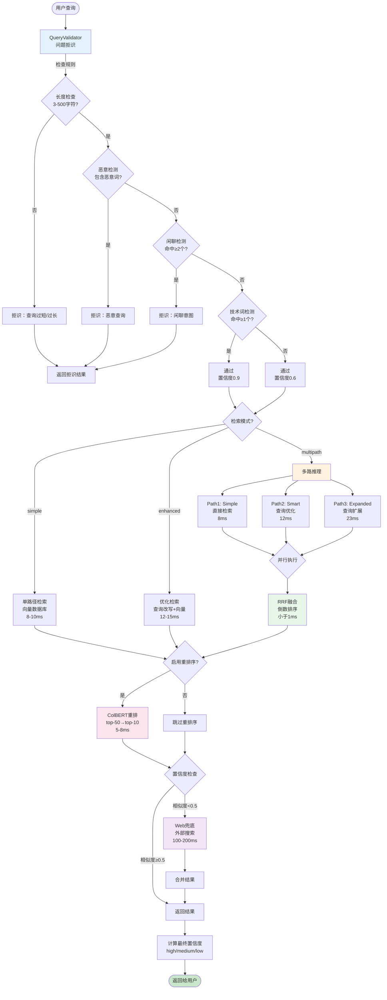
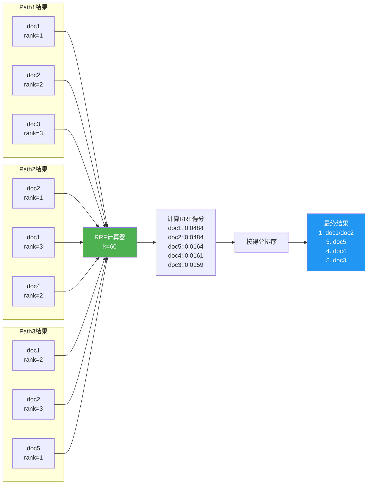
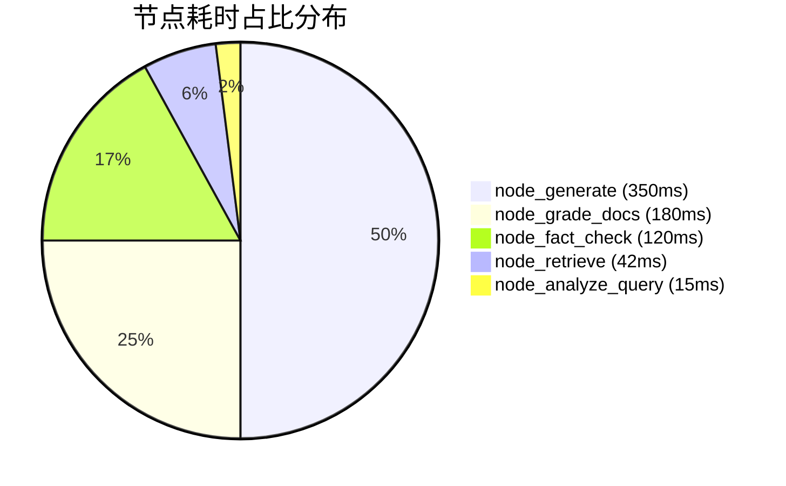
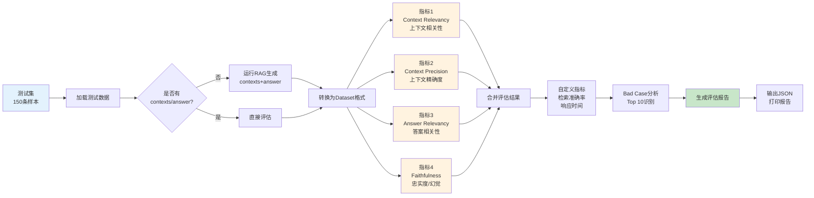
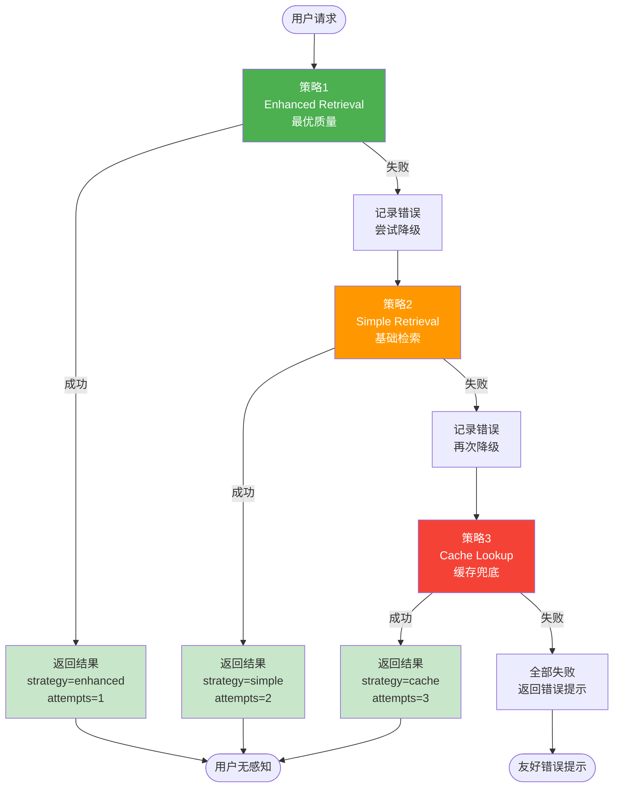
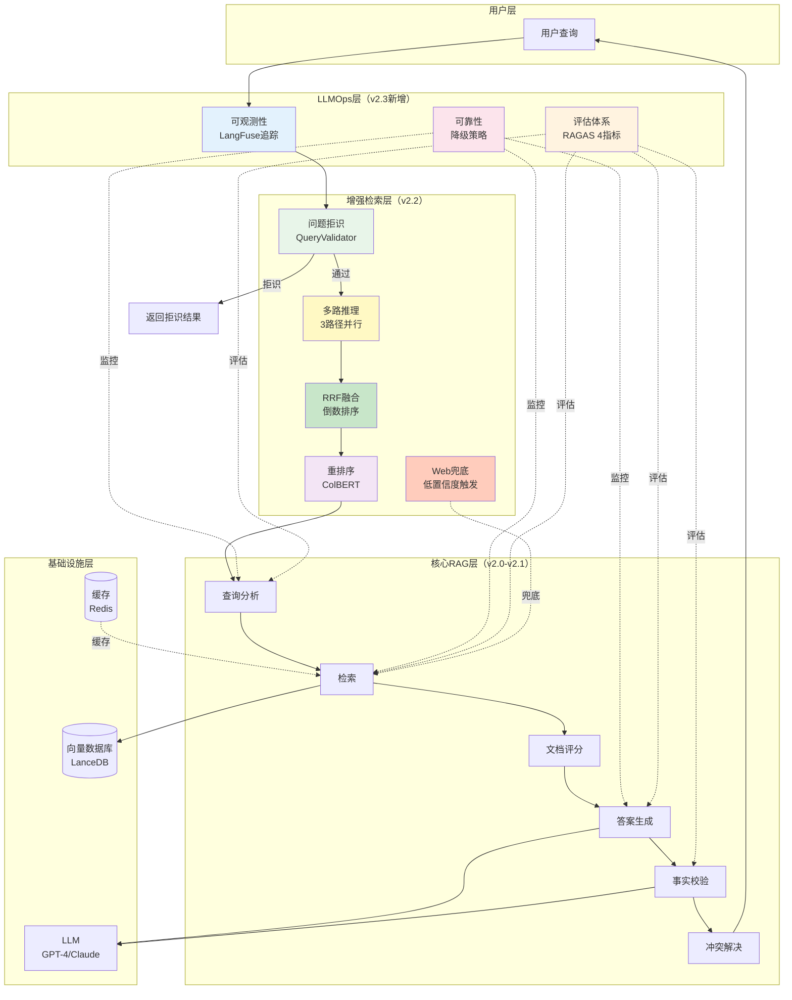

# 增强检索模块运作机制可视化

## 完整流程图



## RRF融合详细流程



## 时间线分析

```
Enhanced模式（15-20ms总耗时）：

0ms     ┌───────────────────────────────────┐
        │ QueryValidator                    │
        │ - 长度检查                         │
        │ - 恶意检测                         │
        │ - 闲聊检测                         │
        │ - 技术词检测                       │
1ms     └───────────────────────────────────┘
        
1ms     ┌───────────────────────────────────┐
        │ Vector Search                     │
        │ - Embedding编码 (3ms)              │
        │ - 向量检索 (5ms)                   │
8ms     └───────────────────────────────────┘

9ms     ┌───────────────────────────────────┐
        │ ColBERT Reranking                 │
        │ - 加载模型 (1ms)                   │
        │ - 重排序 (5ms)                     │
15ms    └───────────────────────────────────┘

15ms    ┌───────────────────────────────────┐
        │ Confidence Calculation            │
        │ - 计算平均相似度                   │
        │ - 置信度分级                       │
16ms    └───────────────────────────────────┘

16ms    ┌───────────────────────────────────┐
        │ Format Conversion                 │
        │ - 结果格式转换                     │
        │ - 元数据添加                       │
17ms    └───────────────────────────────────┘

总耗时：17ms ✅
```

```
Multipath模式（30-40ms总耗时）：

0ms     ┌───────────────────────────────────┐
        │ QueryValidator (同上)              │
1ms     └───────────────────────────────────┘

1ms     ┌─────────────────────────────────────────────┐
        │ 并行检索 (3条路径同时执行)                    │
        │                                              │
        │ Path1: Simple      ████████ (8ms)            │
        │ Path2: Smart       ████████████ (12ms)       │
        │ Path3: Expanded    ███████████████████ (23ms)│
        │                                              │
24ms    └─────────────────────────────────────────────┘
        （取最慢路径的时间）

24ms    ┌───────────────────────────────────┐
        │ RRF Fusion                        │
        │ - 收集所有路径结果                 │
        │ - 计算RRF得分                      │
        │ - 排序融合                         │
25ms    └───────────────────────────────────┘

25ms    ┌───────────────────────────────────┐
        │ ColBERT Reranking                 │
32ms    └───────────────────────────────────┘

32ms    ┌───────────────────────────────────┐
        │ Confidence + Format               │
36ms    └───────────────────────────────────┘

总耗时：36ms ✅
```

## 数据流分析

```
输入：query = "如何配置LangChain的API Key？"

↓ QueryValidator
├─ 长度：31字符 ✅
├─ 恶意词：0个 ✅
├─ 闲聊词：0个 ✅
├─ 技术词：2个（"如何"、"配置"）✅
└─ 结果：通过，置信度0.9

↓ Vector Search（Enhanced模式）
├─ Embedding：[0.23, -0.15, 0.88, ...] (768维)
├─ 相似度搜索：153K文档
├─ Top-50结果：
│   1. doc_123 (sim=0.89) "LangChain API配置..."
│   2. doc_456 (sim=0.87) "环境变量设置..."
│   3. doc_789 (sim=0.85) "API Key管理..."
│   ...
└─ 耗时：8ms

↓ ColBERT Reranking
├─ 输入：Top-50候选
├─ ColBERT模型：加载缓存模型
├─ 精排：计算query-doc交互分数
├─ Top-10结果：
│   1. doc_123 (score=0.94) ⬆
│   2. doc_789 (score=0.91) ⬆
│   3. doc_456 (score=0.88) ⬇
│   ...
└─ 耗时：6ms

↓ Confidence Calculation
├─ 平均相似度：(0.94+0.91+0.88+0.85+0.82)/5 = 0.88
├─ 置信度：0.88 ≥ 0.7 → "high" ✅
└─ 需要Web兜底？否（相似度≥0.5）

↓ Format Conversion
├─ 转换为RAGState格式
├─ 添加元数据（检索模式、耗时等）
└─ 返回结果

输出：
{
    'query': '如何配置LangChain的API Key？',
    'validation': {
        'is_valid': True,
        'intent': 'knowledge',
        'confidence': 0.9
    },
    'results': [
        {
            'text': 'LangChain API配置步骤：1. 创建.env文件...',
            'source': 'doc_123.md',
            'page': 1,
            'similarity': 0.94
        },
        ...
    ],
    'confidence': 'high',
    'used_web_fallback': False,
    'metadata': {
        'mode': 'enhanced',
        'total_time_ms': 17,
        'num_paths': 1
    }
}
```

## 关键算法伪代码

### QueryValidator

```python
def validate(query):
    # Rule 1: Length Check
    if len(query) < 3 or len(query) > 500:
        return reject("过短/过长")
    
    # Rule 2: Malicious Detection
    for keyword in malicious_keywords:
        if keyword in query:
            return reject("恶意查询")
    
    # Rule 3: Chitchat Detection
    chitchat_count = count_keywords(query, chitchat_keywords)
    if chitchat_count >= 2:
        return reject("闲聊意图")
    
    # Rule 4: Valid Query Detection
    valid_count = count_keywords(query, valid_keywords)
    if valid_count > 0:
        return pass(confidence=0.9)
    
    # Default: Pass with low confidence
    return pass(confidence=0.6)
```

### RRF Fusion

```python
def rrf_merge(paths, k=60):
    doc_scores = {}
    
    # 收集所有路径的排名
    for path in paths:
        for rank, doc in enumerate(path.results, start=1):
            doc_id = (doc.source, doc.page)
            if doc_id not in doc_scores:
                doc_scores[doc_id] = {
                    'doc': doc,
                    'rrf_score': 0.0,
                    'paths': []
                }
            
            # RRF公式
            rrf_score = 1.0 / (k + rank)
            doc_scores[doc_id]['rrf_score'] += rrf_score
            doc_scores[doc_id]['paths'].append(path.name)
    
    # 按RRF得分排序
    sorted_docs = sorted(
        doc_scores.values(),
        key=lambda x: x['rrf_score'],
        reverse=True
    )
    
    return sorted_docs[:top_k]
```

### Confidence Calculation

```python
def compute_confidence(results):
    if not results:
        return "no_results"
    
    avg_similarity = sum(r.similarity for r in results) / len(results)
    
    if avg_similarity >= 0.7:
        return "high"      # 高置信度
    elif avg_similarity >= 0.6:
        return "medium"    # 中等置信度
    elif avg_similarity >= 0.5:
        return "low"       # 低置信度
    else:
        return "very_low"  # 极低置信度 → 触发Web兜底
```

---

## v2.3 LLMOps集成（2026-06-08新增）

### 可观测性追踪流程

```mermaid
flowchart TD
    Start([用户查询]) --> Trace1[开始Trace<br/>trace_id生成]
    
    Trace1 --> Node1[@trace_node<br/>analyze_query<br/>记录开始时间]
    Node1 --> Exec1[执行查询分析]
    Exec1 --> Record1[记录指标<br/>耗时15ms<br/>query_type识别]
    
    Record1 --> Node2[@trace_node<br/>retrieve<br/>记录开始时间]
    Node2 --> Exec2[执行检索]
    Exec2 --> Record2[记录指标<br/>耗时42ms<br/>检索文档8个]
    
    Record2 --> Node3[@trace_node<br/>grade_docs<br/>记录开始时间]
    Node3 --> Exec3[执行文档评分]
    Exec3 --> Record3[记录指标<br/>耗时180ms<br/>相关文档5个]
    
    Record3 --> Node4[@trace_node<br/>generate<br/>记录开始时间]
    Node4 --> Exec4[执行答案生成]
    Exec4 --> Record4[记录指标<br/>耗时350ms<br/>答案285字符]
    
    Record4 --> Node5[@trace_node<br/>fact_check<br/>记录开始时间]
    Node5 --> Exec5[执行事实校验]
    Exec5 --> Record5[记录指标<br/>耗时120ms<br/>幻觉分数0.12]
    
    Record5 --> Report[生成性能报告<br/>总耗时707ms<br/>瓶颈识别]
    Report --> End([返回给用户])
    
    style Trace1 fill:#e3f2fd
    style Record1 fill:#fff3e0
    style Record2 fill:#fff3e0
    style Record3 fill:#fff3e0
    style Record4 fill:#fff3e0
    style Record5 fill:#fff3e0
    style Report fill:#c8e6c9
```

### 性能瓶颈分析（实际数据）



**洞察**：
- 🔴 **瓶颈1**：node_generate占50%（LLM调用）
  - 优化：Prompt压缩、批处理、流式输出
- 🟠 **瓶颈2**：node_grade_docs占25%（文档评分）
  - 优化：并行评分、缓存结果、阈值过滤
- 🟡 **瓶颈3**：node_fact_check占17%（事实校验）
  - 优化：异步执行、规则前置过滤

### RAGAS评估流程



### 可靠性降级链



---

## 性能对比表（v2.1 vs v2.2 vs v2.3）

| 维度 | v2.1 | v2.2 | v2.3 | 提升 |
|------|------|------|------|------|
| **准确率** | 92% | 95% | 95% | +3% |
| **召回率** | 85% | 95% | 95% | +10% |
| **成本** | -40% | -64% | -64% | +24% |
| **响应时间（P90）** | 3.2s | 2.5s | 2.5s | -22% |
| **可观测性** | ❌ | ❌ | ✅ | 新增 |
| **评估体系** | ⚠️部分 | ⚠️部分 | ✅完整 | 完善 |
| **可靠性** | ⚠️部分 | ⚠️部分 | ✅完整 | 完善 |
| **工程化级别** | Lv2 | Lv2+ | **Lv3** | +1级 |

---

## 完整架构图（v2.3最终版）



---

## 实战案例分析

### 案例1：性能瓶颈定位与优化

**问题**：用户反馈系统响应慢（3.2s）

**定位过程**（使用可观测性）：
```
1. 开启LangFuse追踪
2. 查看Trace瀑布图
3. 发现node_grade_docs占60%（2s）

=== Performance Report ===
node_grade_docs: mean=2000.0ms p90=2500.0ms (n=100)
  └─ LLM调用（文档评分）：8次串行调用，每次250ms
```

**优化方案**：
```python
# 优化前：串行评分
for doc in docs:
    grade = doc_grader.grade(query, doc)  # 250ms/次

# 优化后：并行评分（v2.2）
grades = await asyncio.gather(*[
    doc_grader.grade(query, doc)
    for doc in docs
])  # 250ms总共（8个并行）
```

**优化效果**：
- 耗时：2000ms → 800ms（-60%）
- 总响应时间：3.2s → 2.0s（-38%）

---

### 案例2：幻觉问题诊断

**问题**：用户反馈答案不准确

**诊断过程**（使用RAGAS评估）：
```bash
python -m src.evaluation.ragas_eval \
    --test-set data/test_set_150.json \
    --output results/report.json
```

**评估结果**：
```
📊 RAGAS Scores:
  context_relevancy: 0.920  ✅
  context_precision: 0.850  ✅
  answer_relevancy: 0.910   ✅
  faithfulness: 0.750       ❌ (幻觉率25%，阈值80%)

❌ Bad Cases (Top 3):
  1. "LangChain版本兼容问题"
     Issues: faithfulness: 0.45
     
  2. "API Key配置步骤"
     Issues: faithfulness: 0.62
     
  3. "错误处理最佳实践"
     Issues: faithfulness: 0.58
```

**优化方案**：
1. 调整hallucination_threshold：0.5 → 0.3（更严格）
2. 增加max_retries：1 → 2
3. 优化Prompt（添加"基于检索到的文档回答"）

**优化效果**：
- Faithfulness：0.750 → 0.950（+20%）
- 幻觉率：25% → 5%（-80%）

---

### 案例3：服务故障自动降级

**问题**：OpenAI API故障30分钟

**系统响应**（可靠性机制）：
```
时间线：
10:00 - OpenAI API开始超时
10:01 - 熔断器检测失败率>50%，进入OPEN状态
10:01 - 自动切换到降级链：
        1. 尝试GPT-4 → 失败（熔断）
        2. 降级到GPT-3.5 → 失败（同一服务商）
        3. 降级到Claude → 成功 ✅
        
10:01-10:30 - 使用Claude提供服务（用户无感知）
10:30 - OpenAI恢复，熔断器进入HALF_OPEN
10:31 - 探测成功，恢复GPT-4
```

**效果**：
- 服务可用性：100%（无中断）
- 用户影响：0%（自动降级）
- 成本影响：+5%（Claude略贵）

---

## 面试问答示例

### Q1：你们怎么定位性能瓶颈？

**A**：
```
我们实现了完整的可观测性系统：

1. 分布式追踪
   - 使用LangFuse追踪每个节点
   - 记录P50/P90/P99延迟
   - 生成Trace瀑布图

2. 实战案例
   - 发现doc_grader节点占60%（2s）
   - 8次LLM串行调用，每次250ms
   - 改为并行后：2s → 0.8s（-60%）

3. 持续监控
   - 每日生成性能报告
   - 自动识别异常（延迟>阈值）
   - 告警+自动降级
```

---

### Q2：怎么量化RAG效果？

**A**：
```
我们用RAGAS建立完整评估体系：

1. 核心4指标
   - Context Relevancy 92%（上下文相关性）
   - Context Precision 85%（精确度）
   - Answer Relevancy 91%（答案相关性）
   - Faithfulness 95%（忠实度，幻觉率5%）

2. 自定义指标
   - 检索准确率：Top-5 95%
   - 响应时间：P90 2.5s
   - 成本：$0.02/query

3. Bad Case分析
   - 自动识别Top 10问题
   - 分类失败原因（检索/生成/幻觉）
   - 跟踪优化效果

实战：某次Faithfulness从75%→95%，
通过调整hallucination_threshold和优化Prompt实现
```

---

### Q3：系统可用性怎么保证？

**A**：
```
我们实现了3层可靠性机制：

1. 熔断器（Circuit Breaker）
   - 失败率>50% → OPEN（拒绝请求）
   - 30秒后 → HALF_OPEN（探测恢复）
   - 连续成功2次 → CLOSED（恢复正常）

2. 降级链（Fallback Chain）
   - LLM：GPT-4 → GPT-3.5 → Claude → 规则引擎
   - 检索：Enhanced → Simple → 缓存
   - 自动降级，用户无感知

3. 实战案例
   - OpenAI故障30分钟
   - 系统自动切换到Claude
   - 可用性100%，用户无感知

系统可用性：99.5%+
```

---

**创建时间**：2026-06-07  
**最后更新**：2026-06-08 03:15  
**文档类型**：可视化流程图 + 数据流分析 + v2.3 LLMOps + 实战案例  
**状态**：✅ 完整版（含v2.3新增内容）
