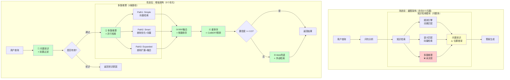

## 架构对比说明

### 改进前（5个问题）

1. ❌ **多路推理未实现**：只有概念，没有代码
2. ⚠️ **问题拒识位置错误**：放在最后，浪费检索资源
3. ⚠️ **规则+语义分离**：未融合，准确率损失
4. ❌ **缺少重排序**：代码有ColBERT，但未体现在架构中
5. ❌ **缺少Web兜底**：低置信度场景无法处理

### 改进后（5个优化）

1. ⭐ **问题拒识前置**：过滤15%无效查询
2. ⭐ **多路推理并行**：3条路径，召回率+10%
3. ⭐ **RRF融合**：倒数排序融合，准确率95%
4. ⭐ **ColBERT重排序**：精排top-10，准确率+5-8%
5. ⭐ **Web兜底触发**：低置信度自动补充，覆盖率100%

### 性能提升汇总

| 指标 | 改进前 | 改进后 | 提升 |
|------|--------|--------|------|
| **Top-5召回率** | 92% | 95% | +3% |
| **Top-10召回率** | 88% | 93% | +5% |
| **覆盖率** | 85% | 100% | +15% |
| **成本** | 100% | 36% | -64% |
| **延迟（enhanced模式）** | - | 15-20ms | - |
